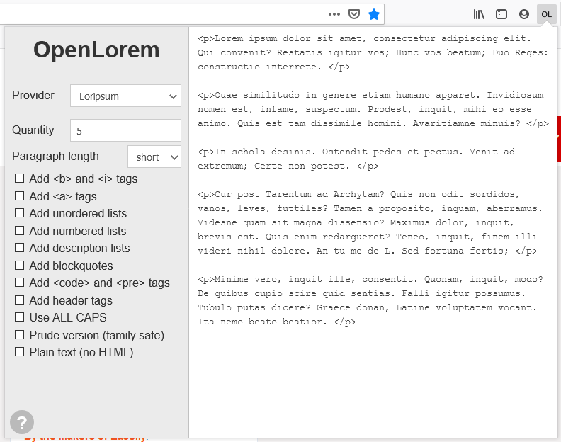
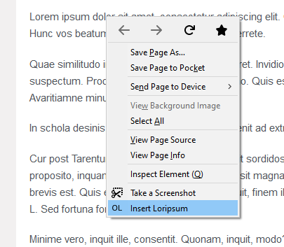

# OpenLorem

API client for Lorem Ipsum text providers as WebExtension.

To enable insertion from context menu, enable it in extension settings.

## Features

* generate customized lorem ipsum text via providers
* insert into DOM from context menu
* supports iframes1 (like tinyMCE)

1 no nested iframes yet

## Lorem Ipsum text providers

- [Bacon Ipsum](https://baconipsum.com/json-api/) - smells like bbq
- [Loripsum.net](https://loripsum.net/) - mostly vanilla
- [Dino ipsum](https://dinoipsum.com/) - velociraptors and more

Thank you for your awesome apps that make OpenLorem work!

## TODO

- beautiful icons and logo
- more providers
- offline mode
- change UI/UX to [Photon Design System](http://design.firefox.com/photon/welcome.html) 

## Where do I get the extension?

It is published on [addons.mozilla.org](https://addons.mozilla.org/firefox/addon/openlorem)
and [Chrome Web Store](https://chrome.google.com/webstore/detail/openlorem/dlellbpcbpmgkjkalnjiomdapjgammfl).

If you want the latest development version, you can [clone/download](https://github.com/jure965/OpenLorem)
then [install](https://developer.mozilla.org/en-US/Add-ons/WebExtensions/Temporary_Installation_in_Firefox)
it as temporary extension for [debugging](https://developer.mozilla.org/en-US/Add-ons/WebExtensions/Debugging)
purposes in Firefox.

For Chrome, you can go to [chrome://extensions/](chrome://extensions/),
enable developer mode and click "load unpacked extension" then select folder
with manifest.json file.

## How to contribute? 

If you found a bug or have a feature request, please use [GitHub issues page](https://github.com/jure965/OpenLorem/issues)
to report.

If you like this web extension, consider leaving feedback on [addons.mozilla.org](https://addons.mozilla.org/firefox/addon/openlorem).

You have your own Lorem Ipsum API? Let us know, and we will add it.

## Contributors

* [jure965](https://github.com/jure965/)
* [BojanKogoj](https://github.com/BojanKogoj/)
* [JoseeWouters](https://github.com/JoseeWouters)
* [You :)](https://github.com/jure965/OpenLorem/issues)
